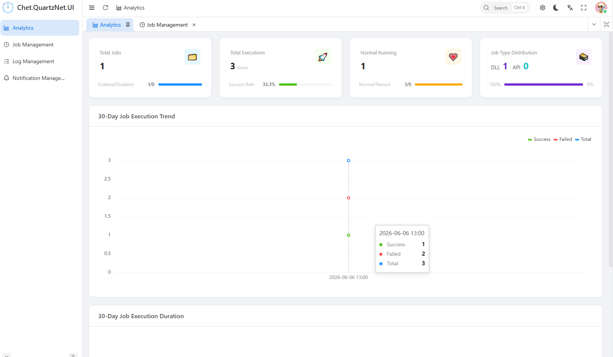
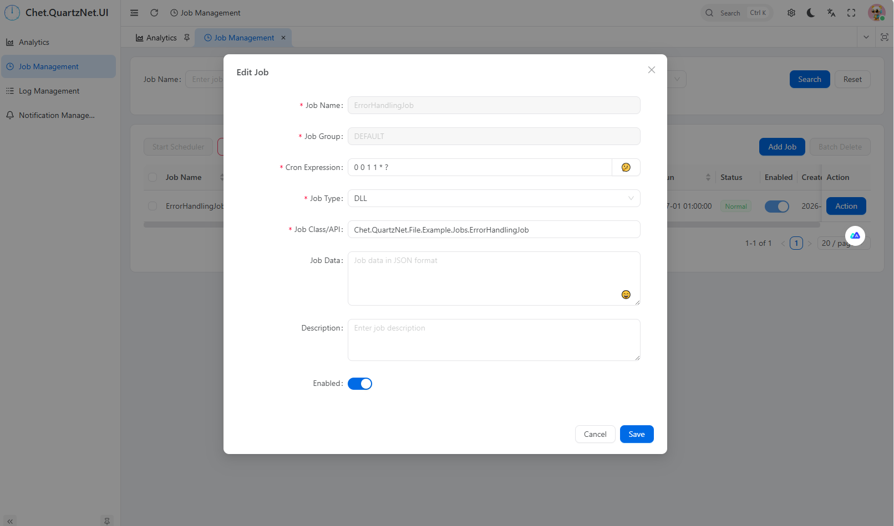
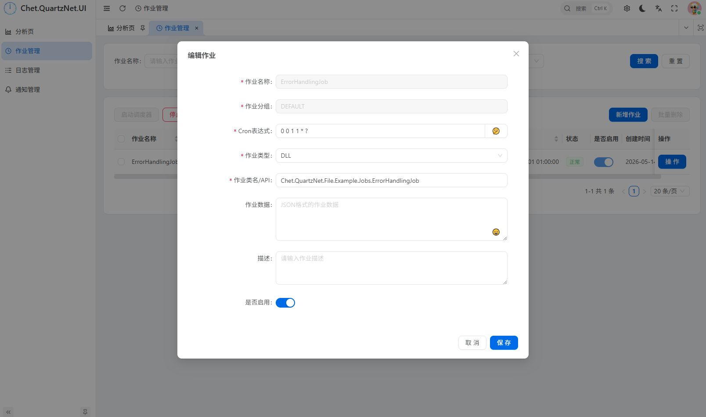
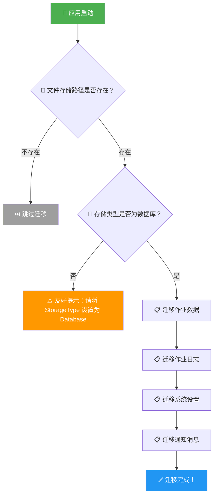
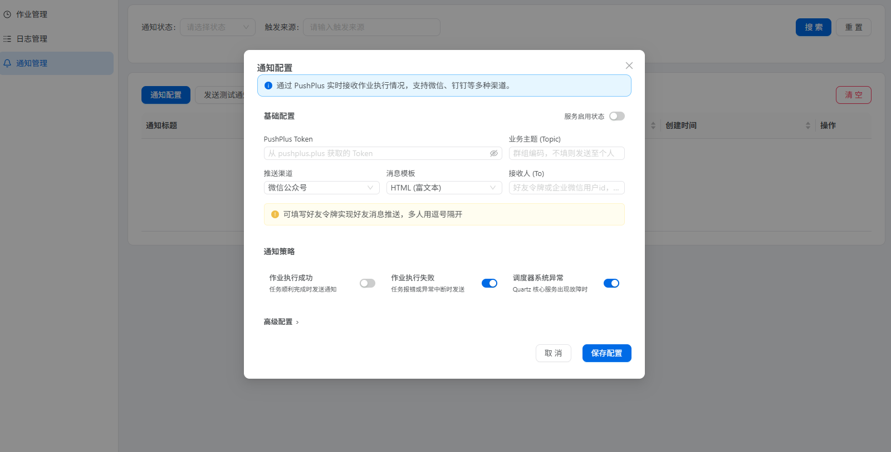

# 🔥 Chet.QuartzNet.UI v2.2.0 来了！多语言支持 + 文件数据迁移，体验全面升级！

## 🎯 这次更新带来了什么？

Chet.QuartzNet.UI v2.2.0 正式发布！这次我们带来了两个重磅功能：**多语言国际化支持** 和 **文件数据自动迁移**，让你的任务调度管理体验再上一个台阶！😍

👉 发布详情：[v2.2.0 Release](https://www.nuget.org/packages/Chet.QuartzNet.UI/)

## ✨ 重磅功能一：多语言国际化支持

### 🌍 为什么要做多语言？

之前 Chet.QuartzNet.UI 只有中文界面，对于海外开发者和国际化团队来说不太友好。现在，我们全面支持了 **中文（zh-CN）** 和 **英文（en-US）** 两种语言，覆盖分析、作业、日志、通知四个页面的所有文案！

### 🎨 多语言支持亮点

- **一键切换**：系统自动识别浏览器语言，也可手动切换
- **全页面覆盖**：分析页、作业管理、日志管理、通知管理，所有文案均已国际化
- **告别硬编码**：所有界面文本统一通过 i18n 管理，维护更方便
- **易于扩展**：新增语言只需添加对应的语言包文件







## ✨ 重磅功能二：文件数据自动迁移

### 🚀 从文件存储到数据库，一键搞定！

很多开发者一开始使用文件存储模式快速上手，随着业务增长需要切换到数据库存储。之前这个过程需要手动处理，现在 v2.2.0 带来了**自动迁移**功能！

### 💡 迁移功能亮点

- **自动检测**：系统启动时自动检测文件存储路径，发现数据后自动触发迁移
- **全量迁移**：作业数据、执行日志、系统设置、通知消息，一个不落
- **安全可靠**：迁移前自动检查存储类型，非数据库模式友好提示，不会误操作
- **零配置**：只需将 `StorageType` 切换为 `Database`，其余全自动完成

### 📝 迁移流程



### 🔧 如何使用迁移功能？

只需三步，轻松完成从文件存储到数据库的迁移：

#### 1️⃣ 安装数据库扩展包

```bash
# 以 MySQL 为例
dotnet add package Chet.QuartzNet.EFCore.MySql
```

#### 2️⃣ 修改配置

将 `appsettings.json` 中的 `StorageType` 从 `File` 改为 `Database`：

```json
{
  "ConnectionStrings": {
    "QuartzUI": "server=localhost;database=quartz_ui;user=root;password=123456;charset=utf8mb4;"
  },
  "QuartzUI": {
    "StorageType": "Database",
    "DatabaseProvider": "mysql",
  }
}
```

#### 3️⃣ 注册迁移服务

在 `Program.cs` 中调用 `AddFileDataToDatabase()` 方法，启用文件数据自动迁移：

```csharp
var builder = WebApplication.CreateBuilder(args);

// 添加 Quartz UI 服务（数据库存储模式）
builder.Services.AddQuartzUI(builder.Configuration);

// 启用文件数据自动迁移到数据库
builder.Services.AddFileDataToDatabase();

var app = builder.Build();
app.UseQuartz();
app.Run();
```

#### 4️⃣ 启动应用，自动迁移

```bash
dotnet run
```

启动后系统会自动检测 `FileStoragePath` 路径下的文件数据，并迁移到数据库中。迁移完成后，日志中会输出迁移结果。

> ⚠️ **注意**：迁移前请确保 `StorageType` 已设置为 `Database`，否则系统会友好提示跳过迁移。

## 🎁 更多更新内容

### 📢 推送通知多通道支持

v2.2.0 扩展了推送通知的通道类型，新增 **webhook、voice、extension、app** 四种通道，并为 PushPlus 新增了 option、to、callbackUrl、timestamp 等高级配置参数。



### 🗑️ 删除作业同步清理日志

之前删除作业后，对应的执行日志仍然保留在数据库中，造成数据冗余。现在删除作业时会自动清除该作业的所有日志，保持数据整洁！

### 🛡️ 其他优化与修复

- 防止 401 错误传播到页面 catch 块，避免重复弹窗
- 修复暗色模式下样式选择器语法问题
- 优化通知配置 UI，根据通道动态展示配置项
- 统一代码格式，重构多处细节

## 💡 升级指南

### 1️⃣ 更新 NuGet 包

```bash
dotnet add package Chet.QuartzNet.UI --version 2.2.0
```

如果使用数据库存储，同步更新对应的扩展包：

```bash
dotnet add package Chet.QuartzNet.EFCore.MySql --version 2.2.0
dotnet add package Chet.QuartzNet.EFCore.PostgreSql --version 2.2.0
dotnet add package Chet.QuartzNet.EFCore.SqlServer --version 2.2.0
dotnet add package Chet.QuartzNet.EFCore.SQLite --version 2.2.0
```

### 2️⃣ 启动应用

更新包后直接启动即可，多语言支持自动生效，无需额外配置！

## 🎉 总结

v2.2.0 是一次体验升级的版本：

| 功能 | 说明 |
|------|------|
| 🌍 多语言支持 | 中英文一键切换，全页面覆盖 |
| 🚀 文件数据迁移 | 从文件存储到数据库，自动完成 |
| 📢 多通道通知 | webhook、voice、extension、app |
| 🗑️ 日志同步清理 | 删除作业自动清理关联日志 |
| 🛡️ 体验优化 | 401处理、暗色模式修复、UI优化 |

如果你对新功能有任何建议或反馈，欢迎在 GitHub 上提出 Issue 或提交 PR，我们期待你的参与！😊

#dotnet #任务调度 #QuartzNet #多语言 #数据迁移 #可视化管理 #开发者工具 #效率神器

---

**⭐ 如果你觉得这篇文章对你有帮助，记得点赞收藏关注哦！**

**📌 更多干货内容，敬请期待！**
